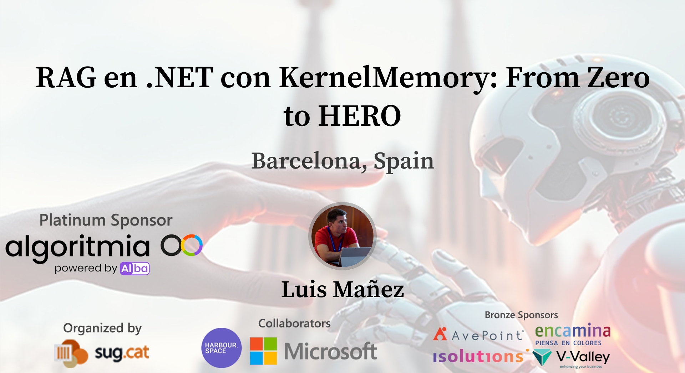

# Global AI Barcelona 2025

Materiales de mi sesión "RAG en .NET con KernelMemory: From Zero to HERO" para el Global AI Barcelona 2025

## RAG en .NET con KernelMemory: From Zero to HERO

> A estas alturas, estarás cansado de escuchar sobre RAG, pero ¿sabes implementarlo de manera efectiva en tu solución .NET? ¿Conoces la librería open source de Microsoft, KernelMemory? En esta sesión, veremos una implementación completa de RAG en .NET, cómo configurar KernelMemory para conectarlo con Azure AI Search, así como las muchas opciones de personalización que nos ofrece y cómo nos facilita la vida.
Y ya que estamos en faena, ¿por qué no lo integramos con Semantic Kernel como un plugin más?… ¡Será divertido!
